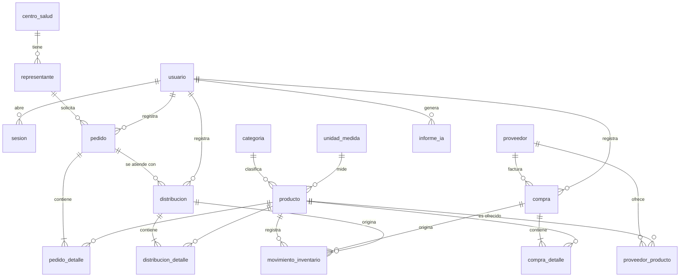

# 02 · Modelo de dominio y reglas de negocio

> **Uso:** referencia común para todas las especificaciones. Cuando `/speckit-specify` o `/speckit-plan` necesiten saber qué es una entidad o qué regla aplica, se remiten a este documento.
>
> Los tipos son **lógicos**. El esquema Prisma definitivo se escribe en `/speckit-plan`.

---

## 1. Vista general

**17 tablas.** Frente al modelo 2022: `Personal` → `usuario`; `ProvProc` → `proveedor_producto`; `Realiza` → `distribucion_detalle`; nuevas: `unidad_medida`, `movimiento_inventario`, `informe_ia`. Ya **no hay tabla de roles** (D-10).

**Campos comunes a todas las tablas:** `id` (entero autoincremental), `creado_en` (fecha y hora), `actualizado_en` (fecha y hora). Los catálogos agregan `activo` (booleano, por defecto verdadero).

---

## 2. Entidades

### 2.1 Acceso

**usuario** — el personal que opera el sistema (requerimientos 1, 11 y 13; RF 1)

| Campo | Tipo | Reglas |
|---|---|---|
| nombre | texto(60) | obligatorio |
| apellido | texto(60) | obligatorio |
| cargo | texto(60) | obligatorio. Informativo: no otorga permisos |
| direccion | texto(150) | opcional |
| telefono | texto(20) | opcional; dígitos, espacios, `+` y `-` |
| nombre_usuario | texto(30) | obligatorio, 3 a 30 caracteres, **único** sin distinguir mayúsculas; minúsculas, dígitos, `.` y `_` |
| contrasena_hash | texto(100) | bcrypt; nunca se muestra |
| debe_cambiar_contrasena | booleano | verdadero para el usuario inicial y tras un restablecimiento (RN-05, RN-06) |
| activo | booleano | |

**sesion** — bitácora de ingreso (RF 7)

| Campo | Tipo | Reglas |
|---|---|---|
| usuario_id | FK usuario | |
| inicio | fecha y hora | |
| fin | fecha y hora | nulo mientras esté abierta; se llena al cerrar sesión o al expirar |
| motivo_cierre | enum `USUARIO`, `EXPIRADA`, `DESACTIVACION`, `RESTABLECIMIENTO`, nulo | nulo mientras esté abierta |

### 2.2 Catálogos

**categoria** — `nombre` texto(60), único · `descripcion` texto(200), opcional

**unidad_medida** — `nombre` texto(40), único (Unidad, Litro, Bidón 5 L, Caja x 12…) · `abreviatura` texto(10)

**producto** (requerimientos 2 y 3)

| Campo | Tipo | Reglas |
|---|---|---|
| codigo | texto(20) | obligatorio, **único**. Ej. `LIM-001` |
| nombre | texto(80) | obligatorio, **único** sin distinguir mayúsculas ni espacios extra |
| descripcion | texto(200) | opcional |
| categoria_id | FK categoria | obligatorio, categoría activa |
| unidad_medida_id | FK unidad_medida | obligatorio, unidad activa |
| stock_actual | entero ≥ 0 | **no se edita en el formulario**; solo lo modifica el kardex. Inicia en 0 |
| stock_minimo | entero ≥ 0 | obligatorio; alimenta alertas y reposición |

**proveedor** (requerimiento 5)

| Campo | Tipo | Reglas |
|---|---|---|
| razon_social | texto(100) | obligatorio |
| nit | texto(20) | obligatorio, **único**, solo dígitos |
| contacto_nombre | texto(80) | opcional (era `Representante` en 2022) |
| telefono | texto(20) | opcional |
| correo | texto(100) | opcional, formato de correo |
| direccion | texto(150) | opcional |

**proveedor_producto** — qué productos ofrece cada proveedor (P3)

| Campo | Tipo | Reglas |
|---|---|---|
| proveedor_id, producto_id | FK | par **único** |
| precio_referencial | decimal(12,2) > 0 | opcional |

**centro_salud** (requerimiento 9) — `nombre` texto(100), único · `telefono` texto(20) · `direccion` texto(150). En operación hay **uno** (D-11).

**representante** (requerimiento 6)

| Campo | Tipo | Reglas |
|---|---|---|
| nombre | texto(60) | obligatorio |
| apellido | texto(60) | obligatorio |
| ci | texto(15) | obligatorio, **único** (evita duplicados) |
| servicio | texto(60) | obligatorio; área que representa (S-01) |
| telefono | texto(20) | opcional |
| centro_salud_id | FK centro_salud | obligatorio, centro activo |

### 2.3 Compras

**compra** (requerimiento 8; RF 4)

| Campo | Tipo | Reglas |
|---|---|---|
| proveedor_id | FK proveedor | obligatorio, proveedor activo |
| nro_factura | texto(20) | obligatorio, solo dígitos. **Único por proveedor** |
| fecha | fecha | obligatoria, no futura |
| total | decimal(12,2) | calculado por el servidor |
| observacion | texto(200) | opcional |
| estado | enum `REGISTRADA`, `ANULADA` | |
| motivo_anulacion | texto(200) | obligatorio si está ANULADA |
| anulada_en | fecha y hora | |
| usuario_id | FK usuario | quien la registró |

**compra_detalle** — `compra_id` · `producto_id` (activo; no se repite dentro de la misma compra) · `cantidad` entero > 0 · `precio_unitario` decimal(12,2) > 0 · `subtotal` decimal(12,2), calculado

### 2.4 Pedidos

**pedido** (requerimiento 4; RF 5)

| Campo | Tipo | Reglas |
|---|---|---|
| representante_id | FK representante | obligatorio, representante activo |
| fecha | fecha | obligatoria, no futura |
| observacion | texto(200) | opcional |
| estado | enum `PENDIENTE`, `PARCIAL`, `ATENDIDO`, `ANULADO` | ver RN-41 |
| motivo_anulacion | texto(200) | obligatorio si está ANULADO |
| usuario_id | FK usuario | |

**pedido_detalle** — `pedido_id` · `producto_id` (activo; único dentro del pedido) · `cantidad_solicitada` entero > 0 · `cantidad_entregada` entero ≥ 0 y ≤ solicitada (se actualiza con cada distribución y anulación)

### 2.5 Distribución

**distribucion** (requerimiento 7; RF 3)

| Campo | Tipo | Reglas |
|---|---|---|
| pedido_id | FK pedido | obligatorio; pedido en PENDIENTE o PARCIAL |
| nro_vale | texto(20) | obligatorio, solo dígitos, **único** |
| fecha | fecha | obligatoria, no futura, no anterior a la fecha del pedido |
| observacion | texto(200) | opcional |
| estado | enum `REGISTRADA`, `ANULADA` | |
| motivo_anulacion, anulada_en | | como en compra |
| usuario_id | FK usuario | |

**distribucion_detalle** — `distribucion_id` · `producto_id` (debe estar en el pedido) · `cantidad` entero > 0

### 2.6 Inventario

**movimiento_inventario** — el kardex

| Campo | Tipo | Reglas |
|---|---|---|
| producto_id | FK producto | |
| fecha | fecha y hora | momento del registro |
| tipo | enum | `ENTRADA_COMPRA`, `SALIDA_DISTRIBUCION`, `ANULACION_COMPRA` (salida), `ANULACION_DISTRIBUCION` (entrada) |
| cantidad | entero | **con signo**: positiva = entrada, negativa = salida |
| saldo_resultante | entero ≥ 0 | stock del producto después del movimiento |
| compra_id | FK compra, nulo | documento que lo originó |
| distribucion_id | FK distribucion, nulo | documento que lo originó |
| usuario_id | FK usuario | |

> Sin tipo de ajuste manual en esta entrega: los errores se corrigen anulando el documento. Si alcanza el tiempo, se agrega `AJUSTE` (P3).

### 2.7 Inteligencia artificial

**informe_ia** (requerimientos 14 y 15)

| Campo | Tipo | Reglas |
|---|---|---|
| tipo | enum `COMPRAS`, `DISTRIBUCIONES` | |
| desde, hasta | fecha | período analizado |
| datos_entrada | JSON | agregados exactos que se enviaron al modelo |
| texto | texto largo | redacción devuelta |
| modelo | texto(60) | identificador del modelo usado |
| usuario_id | FK usuario | |

> El pronóstico **no se guarda**: se calcula al pedirlo, a partir del kardex (es determinista, así que siempre da el mismo resultado con los mismos datos).

---

## 3. Reglas de negocio

### Acceso (RN-0x)
- **RN-01** Solo inicia sesión un usuario **activo**, con usuario y contraseña correctos. El mensaje de error es genérico ("Usuario o contraseña incorrectos"), sin decir cuál de los dos falló.
- **RN-02** La contraseña tiene al menos 8 caracteres y se guarda con hash bcrypt.
- **RN-03** La sesión expira tras 8 horas; al expirar o al cerrar sesión se registra `sesion.fin`.
- **RN-04** Un usuario no puede desactivarse a sí mismo, y siempre tiene que quedar al menos un usuario activo.
- **RN-05** La base se crea con un usuario inicial mediante la semilla; su contraseña se cambia en el primer uso.
- **RN-06** Restablecer la contraseña de otra persona le asigna una contraseña temporal, cierra sus sesiones abiertas y la obliga a cambiarla en su siguiente ingreso. Desactivar a una persona también cierra sus sesiones abiertas. Nadie restablece su propia contraseña: la cambia indicando la actual.

### Catálogos (RN-1x)
- **RN-10** Los campos únicos se comparan normalizados: sin espacios al inicio ni al final, espacios internos simples y sin distinguir mayúsculas.
- **RN-11** Un duplicado se informa nombrando el campo ("Ya existe un producto con el nombre 'Lavandina 1 L'").
- **RN-12** Dar de baja no borra: marca `activo = falso`. Se puede reactivar.
- **RN-13** No se puede dar de baja una categoría o unidad de medida con productos activos asociados, ni un centro de salud con representantes activos.
- **RN-14** Los registros inactivos no aparecen en los selectores de documentos nuevos, pero sí en consultas, reportes e histórico.
- **RN-15** `stock_actual` no se puede modificar desde el catálogo de productos.

### Compras (RN-2x)
- **RN-20** La compra se guarda completa (cabecera, detalle y movimientos de kardex) en **una transacción**, o no se guarda nada.
- **RN-21** El Nº de factura no se repite **para el mismo proveedor**. Se valida al salir del campo, para avisar antes, y otra vez al guardar, como autoridad.
- **RN-22** La compra tiene al menos una línea; un producto no se repite dentro de la compra.
- **RN-23** `subtotal = cantidad × precio_unitario` y `total = Σ subtotales`, calculados en el servidor.
- **RN-24** Cada línea genera un movimiento `ENTRADA_COMPRA` y suma la cantidad a `stock_actual`.
- **RN-25** Anular una compra exige motivo y genera `ANULACION_COMPRA` por línea. **No se permite** si con eso algún producto quedaría con stock negativo (porque ya se distribuyó); el mensaje indica qué producto y cuánto falta.
- **RN-26** Una compra anulada no se puede volver a anular ni editar. **La unicidad de RN-21 solo cuenta compras REGISTRADAS**: si se anuló una compra por tener mal los productos, se puede volver a registrar con el mismo Nº de factura. (En la base se implementa con un índice único parcial.)

### Pedidos (RN-4x)
- **RN-40** El pedido tiene al menos una línea; productos activos y sin repetir; representante activo.
- **RN-41** El estado **se calcula**, no se elige:
  - `PENDIENTE`: ninguna línea tiene entregas.
  - `PARCIAL`: hay alguna entrega, pero no todas las líneas están completas.
  - `ATENDIDO`: en todas las líneas `cantidad_entregada = cantidad_solicitada`.
  - `ANULADO`: lo decide el usuario (RN-43).
- **RN-42** Un pedido solo se puede editar mientras está `PENDIENTE`.
- **RN-43** Se puede anular un pedido `PENDIENTE` o `PARCIAL`, con motivo. Si está `PARCIAL`, lo ya entregado se mantiene y se anula solo el saldo.

### Distribución (RN-3x)
- **RN-30** La distribución se guarda completa (cabecera, detalle, kardex y actualización del pedido) en **una transacción**.
- **RN-31** El Nº de vale es único entre las distribuciones REGISTRADAS (mismo criterio que RN-26).
- **RN-32** Por cada línea, la cantidad debe cumplir: `> 0`, `≤ saldo pendiente de esa línea del pedido` y `≤ stock_actual`. Se valida dentro de la transacción con bloqueo del producto, para que dos distribuciones simultáneas no dejen stock negativo.
- **RN-33** Se permite atender parcialmente; no hace falta incluir todas las líneas del pedido.
- **RN-34** Cada línea genera `SALIDA_DISTRIBUCION`, resta `stock_actual`, suma `pedido_detalle.cantidad_entregada` y recalcula el estado del pedido (RN-41).
- **RN-35** Anular una distribución exige motivo; genera `ANULACION_DISTRIBUCION`, repone el stock, descuenta `cantidad_entregada` y recalcula el estado del pedido. No se puede anular si el pedido está ANULADO.
- **RN-36** El formulario muestra, por producto: solicitado, entregado, pendiente y stock disponible.

### Inventario (RN-5x)
- **RN-50** `stock_actual` de un producto = suma de `cantidad` de todos sus movimientos. Se incluye una verificación automatizada de esta igualdad.
- **RN-51** `saldo_resultante` de cada movimiento = saldo del movimiento anterior del producto + cantidad.
- **RN-52** Un producto está **bajo mínimo** cuando `stock_actual ≤ stock_minimo`.
