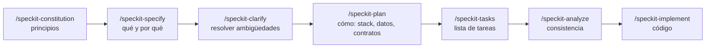

# Especificación · Sistema de almacén Regional Oruro

Paquete de insumos para desarrollar el sistema con **Spec-Driven Development (SDD)** usando **GitHub Spec Kit** y Claude Code.

| Archivo | Qué contiene | Para qué comando de Spec Kit |
|---|---|---|
| [00-decisiones-y-alcance.md](00-decisiones-y-alcance.md) | Decisiones, alcance, defectos corregidos, prioridades, supuestos y pendientes | Referencia de todos |
| [01-constitucion-insumo.md](01-constitucion-insumo.md) | Principios no negociables del proyecto | `/speckit-constitution` |
| [02-modelo-de-dominio.md](02-modelo-de-dominio.md) | Entidades, campos y reglas de negocio (RN-xx) | `/speckit-specify` y `/speckit-plan` |
| [03-funcionalidades.md](03-funcionalidades.md) | Las 7 funcionalidades, con historias y criterios de aceptación | `/speckit-specify` (una vez por funcionalidad) |

---

## Qué es SDD y cómo lo aplica Spec Kit

En lugar de pedirle código a la IA directamente, primero se escribe **qué** debe hacer el sistema y **por qué**. Esa especificación se revisa, se aclara y recién después se convierte en un plan técnico, luego en tareas y al final en código. La especificación es la fuente de verdad: si algo cambia, se cambia primero ahí.



La constitución se escribe **una vez**. De `specify` en adelante, el ciclo se repite **por cada funcionalidad** (F-001 … F-007). Cada una queda en su carpeta `specs/00x-nombre/`, con `spec.md`, `plan.md`, `tasks.md` y otros archivos de apoyo.

---

## Instalación (hecha el 13/09/2026)

| Paso | Estado | Nota |
|---|---|---|
| `uv` 0.12.13 | ✅ | `winget install --id=astral-sh.uv -e`. Hay que **reabrir la terminal** para que se reconozca |
| Spec Kit CLI 1.0.6 | ✅ | Instalado con el Python 3.13 del equipo, porque el Python 3.14 que baja `uv` falló al configurarse: `uv tool install specify-cli --python "C:\Python313\python.exe" --from git+https://github.com/github/spec-kit.git@v1.0.6` |
| Proyecto `almacen-oruro` | ✅ | `specify init almacen-oruro --integration claude --script ps --non-interactive --ignore-agent-tools` |
| Repositorio git local | ✅ | Con `.gitignore` que excluye `.env` y `node_modules`. Sin commits todavía |
| Node 22 LTS | ✅ | v22.23.2 con npm 10.9.8 (`nvm install 22` y `nvm use 22`) |

**Qué creó `specify init`:**
- `.specify/`: plantillas, scripts de PowerShell y `memory/constitution.md`, que por ahora es una plantilla vacía.
- `.claude/skills/speckit-*`: los comandos de Spec Kit instalados como *skills* de Claude Code. En esta versión se escriben **con guion**: `/speckit-specify`, no `/speckit.specify`.

**Para usarlos:** abrir una sesión de Claude Code con la carpeta `almacen-oruro` como directorio de trabajo. Las skills solo se cargan dentro del proyecto.

---

## Uso en este proyecto

**Una vez:**

```text
/speckit-constitution Usa como insumo docs/especificacion/01-constitucion-insumo.md y docs/especificacion/00-decisiones-y-alcance.md
```

**Por cada funcionalidad, en orden F-001 → F-007:**

```text
/speckit-specify <pegar el "Texto para /speckit-specify" de la funcionalidad> Respeta las entidades y reglas de docs/especificacion/02-modelo-de-dominio.md y los criterios de aceptación de la sección F-00x de docs/especificacion/03-funcionalidades.md
```

```text
/speckit-clarify
```

Revisar el `spec.md` generado. Recién cuando está bien, pasar al plan:

```text
/speckit-plan
```

En el primer plan (F-001) se fija la arquitectura: Next.js App Router, TypeScript estricto, Prisma, PostgreSQL 16 en Docker, Zod y Vitest. La librería de sesión se elige ahí, con la explicabilidad como criterio. Los planes siguientes reutilizan esa arquitectura.

```text
/speckit-tasks
```

```text
/speckit-analyze
```

```text
/speckit-implement
```

**Regla práctica:** si durante la implementación aparece algo que la especificación no cubre, **no se improvisa en el código**. Se corrige el `spec.md` (o `02-modelo-de-dominio.md`) y se regenera lo que corresponda.

---

## Cronograma al 21/09

Las especificaciones de las 7 funcionalidades se escriben **juntas al inicio**, porque las reglas se cruzan: una distribución toca el pedido, el kardex y el producto. La implementación va una funcionalidad por día.

| Día | Fecha | Trabajo | Resultado |
|---|---|---|---|
| Dom | 13/09 | Paquete de insumos (este) ✅, instalación ✅, `specify init` ✅, constitución ✅ | Proyecto inicializado |
| Lun | 14/09 | `specify` + `clarify` de F-001 a F-007 ✅ (adelantado al 13/09); `plan` de F-001 (arquitectura y esquema completo de datos) | 7 especificaciones revisadas ✅, esquema Prisma |
| Mar | 15/09 | Implementar F-001 ✅ (adelantado: `plan`, `tasks`, `analyze` e implementación el 13–14/09, 77 pruebas en verde) y F-002 ✅ (adelantado al 14/09: 198 pruebas en verde) | Ingreso y catálogos funcionando |
| Mié | 16/09 | Implementar F-003 ✅ (adelantado al 15/09: 289 pruebas en verde) | Compras, kardex y existencias |
| Jue | 17/09 | Implementar F-004 y F-005 | Ciclo completo compra → pedido → distribución |
| Vie | 18/09 | Implementar F-006 y el generador de datos simulados de F-007 | Reportes y 36 meses de datos |
| Sáb | 19/09 | Implementar pronóstico, evaluación, reposición e informes IA | Módulo de IA |
| Dom | 20/09 | Prueba de punta a punta, `/speckit-analyze`, correcciones, `docs/decisiones.md`, guía de instalación | Versión candidata |
| Lun | 21/09 | **Entrega a Raymond** | Sistema, especificaciones y documento de decisiones |

**No hay días de margen.** Si un día se atrasa, se aplica el orden de corte de `00-decisiones-y-alcance.md` §5 **antes** de mover las fechas.
