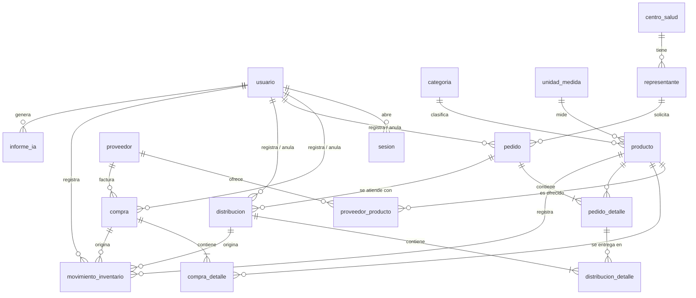
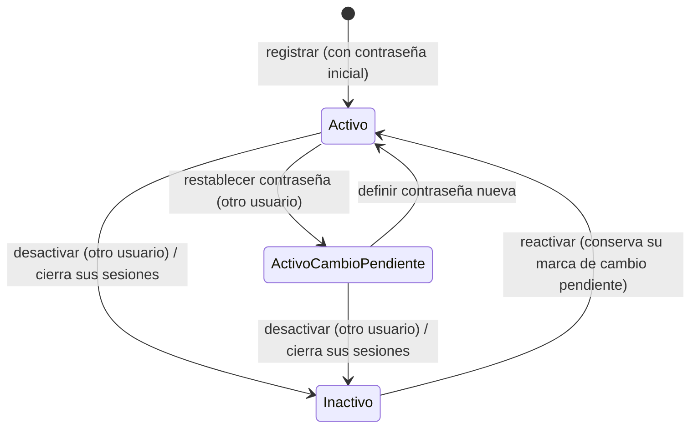
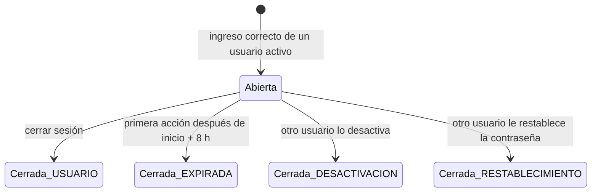

# Modelo de datos · Esquema completo del sistema (fijado en el plan de F-001)

**Fecha**: 2026-09-13 · **Plan**: [plan.md](plan.md) · **Fuente lógica**:
[`docs/especificacion/02-modelo-de-dominio.md`](../../docs/especificacion/02-modelo-de-dominio.md)

Este documento traduce el modelo lógico a un **esquema físico de PostgreSQL 16 con Prisma 7**. Lo
reutilizan todos los planes siguientes: F-002 a F-007 **no redefinen tablas**; si necesitan un
cambio, lo proponen aquí y en `02-modelo-de-dominio.md`.

Contenido:

1. [Convenciones](#1-convenciones)
2. [Mapa de las 18 tablas](#2-mapa-de-las-18-tablas)
3. [Esquema Prisma](#3-esquema-prisma)
4. [Restricciones CHECK (migración SQL propia)](#4-restricciones-check-migración-sql-propia)
5. [Detalle de F-001: usuario y sesión](#5-detalle-de-f-001-usuario-y-sesión)
6. [Cambios respecto del modelo lógico](#6-cambios-respecto-del-modelo-lógico)

---

## 1. Convenciones

| Aspecto | Regla | Ejemplo |
|---|---|---|
| Tablas y columnas | `snake_case`, singular, en español | `movimiento_inventario.saldo_resultante` |
| Modelos Prisma | PascalCase singular, con `@@map` | `model MovimientoInventario` |
| Campos Prisma | camelCase, con `@map` | `saldoResultante` |
| Clave primaria | `id` entero autoincremental | |
| Auditoría | `creado_en` y `actualizado_en` (`timestamptz`) en todas las tablas | |
| Baja lógica | `activo` booleano, por defecto `true`, en los catálogos | |
| Fechas de documento | `date`, sin hora | `compra.fecha` |
| Momentos | `timestamptz(3)` | `sesion.inicio` |
| Importes | `decimal(12,2)` | `compra.total` |
| Cantidades | `integer` | `pedido_detalle.cantidad_solicitada` |
| Textos | `varchar(n)` con el largo del modelo lógico | |
| Unicidad normalizada | columna `*_normalizado` con `UNIQUE` (ver research R-06) | `producto.nombre_normalizado` |
| Enumeraciones | tipos `enum` de PostgreSQL | `estado_pedido` |

---

## 2. Mapa de las 18 tablas

| # | Tabla | Módulo | Funcionalidad | Tipo |
|---|---|---|---|---|
| 1 | `usuario` | Acceso | F-001 | Catálogo (baja lógica) |
| 2 | `sesion` | Acceso | F-001 | Bitácora |
| 3 | `categoria` | Catálogos | F-002 | Catálogo |
| 4 | `unidad_medida` | Catálogos | F-002 | Catálogo |
| 5 | `producto` | Catálogos | F-002 | Catálogo |
| 6 | `proveedor` | Catálogos | F-002 | Catálogo |
| 7 | `proveedor_producto` | Catálogos | F-002 | Catálogo (relación) |
| 8 | `centro_salud` | Catálogos | F-002 | Catálogo |
| 9 | `representante` | Catálogos | F-002 | Catálogo |
| 10 | `compra` | Compras | F-003 | Documento (inmutable, se anula) |
| 11 | `compra_detalle` | Compras | F-003 | Detalle de documento |
| 12 | `pedido` | Pedidos | F-004 | Documento (editable solo PENDIENTE) |
| 13 | `pedido_detalle` | Pedidos | F-004 | Detalle de documento |
| 14 | `distribucion` | Distribución | F-005 | Documento (inmutable, se anula) |
| 15 | `distribucion_detalle` | Distribución | F-005 | Detalle de documento |
| 16 | `movimiento_inventario` | Inventario | F-003 y F-005 | Kardex (solo inserción) |
| 17 | `informe_ia` | IA | F-007 | Registro (solo inserción) |
| 18 | `configuracion` | Sistema | F-006 y F-007 | Fila única |



---

## 3. Esquema Prisma

Este es el contenido previsto de `prisma/schema.prisma`. Se implementa en la tarea de base de datos
de F-001 y **se migra completo desde el primer día**, aunque las pantallas de F-002 a F-007 lleguen
después: así hay una sola migración inicial y los planes siguientes no tocan la estructura.

```prisma
// Esquema del Sistema de almacén Regional Oruro.
// Nombres en español: modelos en PascalCase, campos en camelCase,
// tablas y columnas en snake_case (constitución, principio X).

generator client {
  provider        = "prisma-client"
  output          = "../src/generado/prisma"
  previewFeatures = ["partialIndexes"]
}

datasource db {
  provider = "postgresql"
}

// ─── Enumeraciones ────────────────────────────────────────────────

enum MotivoCierreSesion {
  USUARIO
  EXPIRADA
  DESACTIVACION
  RESTABLECIMIENTO

  @@map("motivo_cierre_sesion")
}

enum EstadoDocumento {
  REGISTRADA
  ANULADA

  @@map("estado_documento")
}

enum EstadoPedido {
  PENDIENTE
  PARCIAL
  ATENDIDO
  ANULADO

  @@map("estado_pedido")
}

enum TipoMovimiento {
  ENTRADA_COMPRA
  SALIDA_DISTRIBUCION
  ANULACION_COMPRA
  ANULACION_DISTRIBUCION

  @@map("tipo_movimiento")
}

enum TipoInforme {
  COMPRAS
  DISTRIBUCIONES

  @@map("tipo_informe")
}

// ─── 2.1 Acceso (F-001) ───────────────────────────────────────────

model Usuario {
  id                    Int      @id @default(autoincrement())
  nombre                String   @db.VarChar(60)
  apellido              String   @db.VarChar(60)
  cargo                 String   @db.VarChar(60)
  direccion             String?  @db.VarChar(150)
  telefono              String?  @db.VarChar(20)
  // Se guarda ya en minúsculas y sin espacios: la unicidad no distingue mayúsculas (RN-10)
  nombreUsuario         String   @unique @map("nombre_usuario") @db.VarChar(30)
  contrasenaHash        String   @map("contrasena_hash") @db.VarChar(100)
  debeCambiarContrasena Boolean  @default(false) @map("debe_cambiar_contrasena")
  activo                Boolean  @default(true)
  creadoEn              DateTime @default(now()) @map("creado_en") @db.Timestamptz(3)
  actualizadoEn         DateTime @updatedAt @map("actualizado_en") @db.Timestamptz(3)

  sesiones                  Sesion[]
  comprasRegistradas        Compra[]               @relation("CompraRegistradaPor")
  comprasAnuladas           Compra[]               @relation("CompraAnuladaPor")
  pedidosRegistrados        Pedido[]               @relation("PedidoRegistradoPor")
  pedidosAnulados           Pedido[]               @relation("PedidoAnuladoPor")
  distribucionesRegistradas Distribucion[]         @relation("DistribucionRegistradaPor")
  distribucionesAnuladas    Distribucion[]         @relation("DistribucionAnuladaPor")
  movimientos               MovimientoInventario[]
  informes                  InformeIa[]

  @@map("usuario")
}

model Sesion {
  id            Int                 @id @default(autoincrement())
  usuarioId     Int                 @map("usuario_id")
  // Hash SHA-256 del token de la cookie; el token nunca se guarda (research R-03)
  tokenHash     String              @unique @map("token_hash") @db.Char(64)
  inicio        DateTime            @default(now()) @db.Timestamptz(3)
  fin           DateTime?           @db.Timestamptz(3)
  motivoCierre  MotivoCierreSesion? @map("motivo_cierre")
  creadoEn      DateTime            @default(now()) @map("creado_en") @db.Timestamptz(3)
  actualizadoEn DateTime            @updatedAt @map("actualizado_en") @db.Timestamptz(3)

  usuario Usuario @relation(fields: [usuarioId], references: [id])

  @@index([usuarioId, inicio])
  @@index([inicio])
  @@map("sesion")
}

// ─── 2.2 Catálogos (F-002) ────────────────────────────────────────

model Categoria {
  id                Int      @id @default(autoincrement())
  nombre            String   @db.VarChar(60)
  nombreNormalizado String   @unique @map("nombre_normalizado") @db.VarChar(60)
  descripcion       String?  @db.VarChar(200)
  activo            Boolean  @default(true)
  creadoEn          DateTime @default(now()) @map("creado_en") @db.Timestamptz(3)
  actualizadoEn     DateTime @updatedAt @map("actualizado_en") @db.Timestamptz(3)

  productos Producto[]

  @@map("categoria")
}

model UnidadMedida {
  id                Int      @id @default(autoincrement())
  nombre            String   @db.VarChar(40)
  nombreNormalizado String   @unique @map("nombre_normalizado") @db.VarChar(40)
  abreviatura       String   @db.VarChar(10)
  activo            Boolean  @default(true)
  creadoEn          DateTime @default(now()) @map("creado_en") @db.Timestamptz(3)
  actualizadoEn     DateTime @updatedAt @map("actualizado_en") @db.Timestamptz(3)

  productos Producto[]

  @@map("unidad_medida")
}

model Producto {
  id                Int      @id @default(autoincrement())
  // Se guarda en mayúsculas y sin espacios en los extremos
  codigo            String   @unique @db.VarChar(20)
  nombre            String   @db.VarChar(80)
  nombreNormalizado String   @unique @map("nombre_normalizado") @db.VarChar(80)
  descripcion       String?  @db.VarChar(200)
  categoriaId       Int      @map("categoria_id")
  unidadMedidaId    Int      @map("unidad_medida_id")
  // Solo lo modifica registrarMovimiento() de src/servicios/inventario.ts (principio III)
  stockActual       Int      @default(0) @map("stock_actual")
  stockMinimo       Int      @map("stock_minimo")
  activo            Boolean  @default(true)
  creadoEn          DateTime @default(now()) @map("creado_en") @db.Timestamptz(3)
  actualizadoEn     DateTime @updatedAt @map("actualizado_en") @db.Timestamptz(3)

  categoria      Categoria              @relation(fields: [categoriaId], references: [id])
  unidadMedida   UnidadMedida           @relation(fields: [unidadMedidaId], references: [id])
  proveedores    ProveedorProducto[]
  lineasCompra   CompraDetalle[]
  lineasPedido   PedidoDetalle[]
  movimientos    MovimientoInventario[]

  @@index([categoriaId])
  @@map("producto")
}

model Proveedor {
  id             Int      @id @default(autoincrement())
  razonSocial    String   @map("razon_social") @db.VarChar(100)
  // Solo dígitos (CHECK en la migración de restricciones)
  nit            String   @unique @db.VarChar(20)
  contactoNombre String?  @map("contacto_nombre") @db.VarChar(80)
  telefono       String?  @db.VarChar(20)
  correo         String?  @db.VarChar(100)
  direccion      String?  @db.VarChar(150)
  activo         Boolean  @default(true)
  creadoEn       DateTime @default(now()) @map("creado_en") @db.Timestamptz(3)
  actualizadoEn  DateTime @updatedAt @map("actualizado_en") @db.Timestamptz(3)

  productos ProveedorProducto[]
  compras   Compra[]

  @@map("proveedor")
}

model ProveedorProducto {
  id                Int      @id @default(autoincrement())
  proveedorId       Int      @map("proveedor_id")
  productoId        Int      @map("producto_id")
  precioReferencial Decimal? @map("precio_referencial") @db.Decimal(12, 2)
  activo            Boolean  @default(true)
  creadoEn          DateTime @default(now()) @map("creado_en") @db.Timestamptz(3)
  actualizadoEn     DateTime @updatedAt @map("actualizado_en") @db.Timestamptz(3)

  proveedor Proveedor @relation(fields: [proveedorId], references: [id])
  producto  Producto  @relation(fields: [productoId], references: [id])

  @@unique([proveedorId, productoId])
  @@map("proveedor_producto")
}

model CentroSalud {
  id                Int      @id @default(autoincrement())
  nombre            String   @db.VarChar(100)
  nombreNormalizado String   @unique @map("nombre_normalizado") @db.VarChar(100)
  telefono          String?  @db.VarChar(20)
  direccion         String?  @db.VarChar(150)
  activo            Boolean  @default(true)
  creadoEn          DateTime @default(now()) @map("creado_en") @db.Timestamptz(3)
  actualizadoEn     DateTime @updatedAt @map("actualizado_en") @db.Timestamptz(3)

  representantes Representante[]

  @@map("centro_salud")
}

model Representante {
  id            Int      @id @default(autoincrement())
  nombre        String   @db.VarChar(60)
  apellido      String   @db.VarChar(60)
  // Se guarda en mayúsculas; dígitos con complemento opcional tras guion
  ci            String   @unique @db.VarChar(15)
  servicio      String   @db.VarChar(60)
  telefono      String?  @db.VarChar(20)
  centroSaludId Int      @map("centro_salud_id")
  activo        Boolean  @default(true)
  creadoEn      DateTime @default(now()) @map("creado_en") @db.Timestamptz(3)
  actualizadoEn DateTime @updatedAt @map("actualizado_en") @db.Timestamptz(3)

  centroSalud CentroSalud @relation(fields: [centroSaludId], references: [id])
  pedidos     Pedido[]

  @@index([centroSaludId])
  @@map("representante")
}

// ─── 2.3 Compras (F-003) ──────────────────────────────────────────

model Compra {
  id              Int             @id @default(autoincrement())
  proveedorId     Int             @map("proveedor_id")
  nroFactura      String          @map("nro_factura") @db.VarChar(20)
  fecha           DateTime        @db.Date
  // Calculado por el servidor: suma de subtotales (RN-23)
  total           Decimal         @db.Decimal(12, 2)
  observacion     String?         @db.VarChar(200)
  estado          EstadoDocumento @default(REGISTRADA)
  motivoAnulacion String?         @map("motivo_anulacion") @db.VarChar(200)
  anuladaEn       DateTime?       @map("anulada_en") @db.Timestamptz(3)
  anuladaPorId    Int?            @map("anulada_por_id")
  usuarioId       Int             @map("usuario_id")
  creadoEn        DateTime        @default(now()) @map("creado_en") @db.Timestamptz(3)
  actualizadoEn   DateTime        @updatedAt @map("actualizado_en") @db.Timestamptz(3)

  proveedor   Proveedor              @relation(fields: [proveedorId], references: [id])
  usuario     Usuario                @relation("CompraRegistradaPor", fields: [usuarioId], references: [id])
  anuladaPor  Usuario?               @relation("CompraAnuladaPor", fields: [anuladaPorId], references: [id])
  lineas      CompraDetalle[]
  movimientos MovimientoInventario[]

  // Factura única por proveedor, contando solo compras REGISTRADAS (RN-21, RN-26)
  @@unique([proveedorId, nroFactura], where: raw("estado = 'REGISTRADA'"), map: "compra_factura_vigente_unica")
  @@index([fecha])
  @@map("compra")
}

model CompraDetalle {
  id             Int      @id @default(autoincrement())
  compraId       Int      @map("compra_id")
  productoId     Int      @map("producto_id")
  cantidad       Int
  precioUnitario Decimal  @map("precio_unitario") @db.Decimal(12, 2)
  subtotal       Decimal  @db.Decimal(12, 2)
  creadoEn       DateTime @default(now()) @map("creado_en") @db.Timestamptz(3)
  actualizadoEn  DateTime @updatedAt @map("actualizado_en") @db.Timestamptz(3)

  compra   Compra   @relation(fields: [compraId], references: [id])
  producto Producto @relation(fields: [productoId], references: [id])

  // Un producto no se repite dentro de la compra (RN-22)
  @@unique([compraId, productoId])
  @@map("compra_detalle")
}

// ─── 2.4 Pedidos (F-004) ──────────────────────────────────────────

model Pedido {
  id              Int          @id @default(autoincrement())
  representanteId Int          @map("representante_id")
  fecha           DateTime     @db.Date
  observacion     String?      @db.VarChar(200)
  // Calculado a partir de las líneas, salvo ANULADO (RN-41)
  estado          EstadoPedido @default(PENDIENTE)
  motivoAnulacion String?      @map("motivo_anulacion") @db.VarChar(200)
  anuladaEn       DateTime?    @map("anulada_en") @db.Timestamptz(3)
  anuladaPorId    Int?         @map("anulada_por_id")
  usuarioId       Int          @map("usuario_id")
  creadoEn        DateTime     @default(now()) @map("creado_en") @db.Timestamptz(3)
  actualizadoEn   DateTime     @updatedAt @map("actualizado_en") @db.Timestamptz(3)

  representante  Representante   @relation(fields: [representanteId], references: [id])
  usuario        Usuario         @relation("PedidoRegistradoPor", fields: [usuarioId], references: [id])
  anuladaPor     Usuario?        @relation("PedidoAnuladoPor", fields: [anuladaPorId], references: [id])
  lineas         PedidoDetalle[]
  distribuciones Distribucion[]

  @@index([estado, fecha])
  @@index([representanteId])
  @@map("pedido")
}

model PedidoDetalle {
  id                 Int      @id @default(autoincrement())
  pedidoId           Int      @map("pedido_id")
  productoId         Int      @map("producto_id")
  cantidadSolicitada Int      @map("cantidad_solicitada")
  // Solo la cambian las distribuciones y sus anulaciones (F-005)
  cantidadEntregada  Int      @default(0) @map("cantidad_entregada")
  creadoEn           DateTime @default(now()) @map("creado_en") @db.Timestamptz(3)
  actualizadoEn      DateTime @updatedAt @map("actualizado_en") @db.Timestamptz(3)

  pedido         Pedido                @relation(fields: [pedidoId], references: [id])
  producto       Producto              @relation(fields: [productoId], references: [id])
  entregas       DistribucionDetalle[]

  @@unique([pedidoId, productoId])
  @@map("pedido_detalle")
}

// ─── 2.5 Distribución (F-005) ─────────────────────────────────────

model Distribucion {
  id              Int             @id @default(autoincrement())
  pedidoId        Int             @map("pedido_id")
  nroVale         String          @map("nro_vale") @db.VarChar(20)
  fecha           DateTime        @db.Date
  observacion     String?         @db.VarChar(200)
  estado          EstadoDocumento @default(REGISTRADA)
  motivoAnulacion String?         @map("motivo_anulacion") @db.VarChar(200)
  anuladaEn       DateTime?       @map("anulada_en") @db.Timestamptz(3)
  anuladaPorId    Int?            @map("anulada_por_id")
  usuarioId       Int             @map("usuario_id")
  creadoEn        DateTime        @default(now()) @map("creado_en") @db.Timestamptz(3)
  actualizadoEn   DateTime        @updatedAt @map("actualizado_en") @db.Timestamptz(3)

  // El representante se obtiene del pedido; no se guarda aquí (X-08)
  pedido      Pedido                 @relation(fields: [pedidoId], references: [id])
  usuario     Usuario                @relation("DistribucionRegistradaPor", fields: [usuarioId], references: [id])
  anuladaPor  Usuario?               @relation("DistribucionAnuladaPor", fields: [anuladaPorId], references: [id])
  lineas      DistribucionDetalle[]
  movimientos MovimientoInventario[]

  // Vale único entre distribuciones REGISTRADAS (RN-31)
  @@unique([nroVale], where: raw("estado = 'REGISTRADA'"), map: "distribucion_vale_vigente_unico")
  @@index([fecha])
  @@index([pedidoId])
  @@map("distribucion")
}

model DistribucionDetalle {
  id              Int      @id @default(autoincrement())
  distribucionId  Int      @map("distribucion_id")
  // Cada línea entregada apunta a la línea pedida; el producto se obtiene de ella
  pedidoDetalleId Int      @map("pedido_detalle_id")
  cantidad        Int
  creadoEn        DateTime @default(now()) @map("creado_en") @db.Timestamptz(3)
  actualizadoEn   DateTime @updatedAt @map("actualizado_en") @db.Timestamptz(3)

  distribucion  Distribucion  @relation(fields: [distribucionId], references: [id])
  pedidoDetalle PedidoDetalle @relation(fields: [pedidoDetalleId], references: [id])

  @@unique([distribucionId, pedidoDetalleId])
  @@map("distribucion_detalle")
}

// ─── 2.6 Inventario (F-003, F-005) ────────────────────────────────

model MovimientoInventario {
  id              Int            @id @default(autoincrement())
  productoId      Int            @map("producto_id")
  // Fecha del documento; en anulaciones, la del documento anulado (RN-53)
  fechaDocumento  DateTime       @map("fecha_documento") @db.Date
  registradoEn    DateTime       @default(now()) @map("registrado_en") @db.Timestamptz(3)
  tipo            TipoMovimiento
  // Con signo: positiva entra, negativa sale
  cantidad        Int
  saldoResultante Int            @map("saldo_resultante")
  compraId        Int?           @map("compra_id")
  distribucionId  Int?           @map("distribucion_id")
  usuarioId       Int            @map("usuario_id")
  creadoEn        DateTime       @default(now()) @map("creado_en") @db.Timestamptz(3)
  actualizadoEn   DateTime       @updatedAt @map("actualizado_en") @db.Timestamptz(3)

  producto     Producto      @relation(fields: [productoId], references: [id])
  compra       Compra?       @relation(fields: [compraId], references: [id])
  distribucion Distribucion? @relation(fields: [distribucionId], references: [id])
  usuario      Usuario       @relation(fields: [usuarioId], references: [id])

  // Orden del kardex: id dentro del producto (research R-11)
  @@index([productoId, id])
  // Consultas por período (RN-53)
  @@index([productoId, fechaDocumento])
  @@index([fechaDocumento])
  @@map("movimiento_inventario")
}

// ─── 2.7 Inteligencia artificial y sistema (F-006, F-007) ─────────

model InformeIa {
  id            Int         @id @default(autoincrement())
  tipo          TipoInforme
  desde         DateTime    @db.Date
  hasta         DateTime    @db.Date
  // Agregados exactos enviados al modelo de lenguaje (principio VIII)
  datosEntrada  Json        @map("datos_entrada")
  texto         String      @db.Text
  modelo        String      @db.VarChar(60)
  usuarioId     Int         @map("usuario_id")
  creadoEn      DateTime    @default(now()) @map("creado_en") @db.Timestamptz(3)
  actualizadoEn DateTime    @updatedAt @map("actualizado_en") @db.Timestamptz(3)

  usuario Usuario @relation(fields: [usuarioId], references: [id])

  @@index([tipo, creadoEn])
  @@map("informe_ia")
}

model Configuracion {
  // Fila única: id siempre 1 (CHECK en la migración de restricciones)
  id                Int       @id @default(1)
  modoDemostracion  Boolean   @default(false) @map("modo_demostracion")
  datosSimuladosEn  DateTime? @map("datos_simulados_en") @db.Timestamptz(3)
  semillaSimulacion Int?      @map("semilla_simulacion")
  creadoEn          DateTime  @default(now()) @map("creado_en") @db.Timestamptz(3)
  actualizadoEn     DateTime  @updatedAt @map("actualizado_en") @db.Timestamptz(3)

  @@map("configuracion")
}
```

**Nota sobre borrado:** ninguna relación declara `onDelete: Cascade`. Como el sistema no borra
físicamente (D-15), una eliminación accidental es rechazada por la clave foránea.

---

## 4. Restricciones CHECK (migración SQL propia)

Prisma no expresa restricciones `CHECK` (research R-07). Se agregan en la segunda migración,
`prisma/migrations/<fecha>_restricciones_de_negocio/migration.sql`, creada con
`prisma migrate dev --create-only`. Cada restricción lleva un comentario con su regla.

| Restricción | Tabla | Condición | Regla |
|---|---|---|---|
| `usuario_nombre_usuario_formato` | usuario | `nombre_usuario ~ '^[a-z0-9._]{3,30}$'` | FR-011 (F-001) |
| `usuario_telefono_formato` | usuario | `telefono IS NULL OR telefono ~ '^[0-9 +-]{1,20}$'` | FR-010 (F-001) |
| `sesion_cierre_coherente` | sesion | `(fin IS NULL) = (motivo_cierre IS NULL)` | FR-009 (F-001) |
| `sesion_fin_posterior` | sesion | `fin IS NULL OR fin >= inicio` | RN-03 |
| `producto_stock_no_negativo` | producto | `stock_actual >= 0` | RN-32, principio III |
| `producto_stock_minimo_no_negativo` | producto | `stock_minimo >= 0` | F-002 |
| `proveedor_nit_digitos` | proveedor | `nit ~ '^[0-9]+$'` | F-002 |
| `representante_ci_formato` | representante | `ci ~ '^[0-9]+(-[0-9A-Z]+)?$'` | F-002 |
| `proveedor_producto_precio_positivo` | proveedor_producto | `precio_referencial IS NULL OR precio_referencial > 0` | F-002 |
| `compra_factura_digitos` | compra | `nro_factura ~ '^[0-9]+$'` | F-003 |
| `compra_total_no_negativo` | compra | `total >= 0` | RN-23 |
| `compra_anulacion_coherente` | compra | `(estado = 'ANULADA') = (motivo_anulacion IS NOT NULL AND anulada_en IS NOT NULL AND anulada_por_id IS NOT NULL)` | RN-25 |
| `compra_detalle_cantidad_positiva` | compra_detalle | `cantidad > 0` | F-003 |
| `compra_detalle_precio_positivo` | compra_detalle | `precio_unitario > 0` | F-003 |
| `compra_detalle_subtotal_exacto` | compra_detalle | `subtotal = cantidad * precio_unitario` | RN-23 |
| `pedido_anulacion_coherente` | pedido | `(estado = 'ANULADO') = (motivo_anulacion IS NOT NULL AND anulada_en IS NOT NULL AND anulada_por_id IS NOT NULL)` | RN-43 |
| `pedido_detalle_solicitada_positiva` | pedido_detalle | `cantidad_solicitada > 0` | RN-40 |
| `pedido_detalle_entregada_en_rango` | pedido_detalle | `cantidad_entregada BETWEEN 0 AND cantidad_solicitada` | FR-009 (F-004) |
| `distribucion_vale_digitos` | distribucion | `nro_vale ~ '^[0-9]+$'` | F-005 |
| `distribucion_anulacion_coherente` | distribucion | `(estado = 'ANULADA') = (motivo_anulacion IS NOT NULL AND anulada_en IS NOT NULL AND anulada_por_id IS NOT NULL)` | RN-35 |
| `distribucion_detalle_cantidad_positiva` | distribucion_detalle | `cantidad > 0` | RN-32 |
| `movimiento_cantidad_no_cero` | movimiento_inventario | `cantidad <> 0` | RN-50 |
| `movimiento_saldo_no_negativo` | movimiento_inventario | `saldo_resultante >= 0` | RN-32, RN-51 |
| `movimiento_origen_coherente` | movimiento_inventario | tipos de compra con `compra_id` y sin `distribucion_id`; tipos de distribución al revés | D-05 |
| `movimiento_signo_coherente` | movimiento_inventario | `ENTRADA_COMPRA` y `ANULACION_DISTRIBUCION` positivas; `SALIDA_DISTRIBUCION` y `ANULACION_COMPRA` negativas | RN-24, RN-34 |
| `informe_periodo_valido` | informe_ia | `desde <= hasta` | F-007 |
| `configuracion_fila_unica` | configuracion | `id = 1` | F-006 |

**Lo que la base no garantiza y queda en los servicios** (con pruebas de integración, principio IX):
stock actual igual a la suma de movimientos (RN-50, verificable a pedido), saldo encadenado (RN-51),
estado del pedido calculado (RN-41), coherencia entre la línea de distribución y su pedido, y todas
las reglas que dependen de otras filas (RN-13, RN-16, RN-17, RN-25, RN-32).

---

## 5. Detalle de F-001: usuario y sesión

### 5.1 Usuario

| Campo | Validación en el esquema Zod (cliente y servidor) | Garantía en la base |
|---|---|---|
| nombre, apellido, cargo | obligatorios, 1 a 60 caracteres tras recortar espacios | `varchar(60) NOT NULL` |
| direccion | opcional, hasta 150 | `varchar(150)` |
| telefono | opcional, hasta 20, solo dígitos, espacios, `+` y `-` | `varchar(20)` + CHECK |
| nombreUsuario | se recorta y pasa a minúsculas; 3 a 30 de `[a-z0-9._]` | `UNIQUE` + CHECK |
| contrasena (entrada) | al menos 8 caracteres, sin recortar | — (solo se guarda el hash) |
| contrasenaHash | — (lo calcula el servicio con bcrypt, costo 12) | `varchar(100) NOT NULL` |
| debeCambiarContrasena | — (lo fija el servicio) | `boolean NOT NULL` |
| activo | — (lo cambian desactivar y reactivar) | `boolean NOT NULL` |

Reglas en `src/servicios/personal.ts` y `src/servicios/acceso.ts`: duplicado de nombre de usuario con
mensaje por campo (FR-012), no desactivarse a sí mismo (FR-017), cerrar sesiones al desactivar o
restablecer (FR-008), nunca devolver `contrasenaHash` (FR-014).

**Estados del usuario**



El usuario inicial nace en **ActivoCambioPendiente** (RN-05).

### 5.2 Sesión

| Campo | Cómo se llena |
|---|---|
| usuarioId | al ingresar |
| tokenHash | SHA-256 en hexadecimal del token aleatorio de la cookie |
| inicio | momento del ingreso |
| fin | al cerrar sesión, al detectar la expiración, al desactivar o al restablecer |
| motivoCierre | `USUARIO`, `EXPIRADA`, `DESACTIVACION` o `RESTABLECIMIENTO` |

**Ciclo de vida de una sesión**



**Sesión vigente** = existe con ese `tokenHash`, `fin` es nulo, `inicio + 8 h` es posterior a ahora y
el usuario está activo.

**Sesiones abandonadas:** si nadie vuelve a usar una sesión vencida, su `fin` queda nulo. La consulta
del historial (FR-022) la muestra como "Expirada" con fin igual a `inicio + 8 h` (escenario 3 de la
Historia 2), y el servicio las cierra en la base con esos valores cada vez que alguien ingresa y cada
vez que se consulta el historial, para que la bitácora quede completa.

---

## 6. Cambios respecto del modelo lógico

Estos ajustes se incorporan también a `docs/especificacion/02-modelo-de-dominio.md`:

| Cambio | Motivo |
|---|---|
| `sesion.token_hash` (nuevo) | Identificar la sesión de la cookie sin guardar el token (research R-03) |
| `nombre_normalizado` en `categoria`, `unidad_medida`, `producto` y `centro_salud` (nuevo) | Unicidad de RN-10 con un índice común (research R-06) |
| `distribucion_detalle.pedido_detalle_id` reemplaza a `producto_id` | La línea entregada apunta a la línea pedida: la base garantiza que el producto esté en el pedido y no se guarda el producto dos veces (mismo criterio que X-07) |
| `proveedor_producto.activo` (explícito) | Ya estaba implícito por ser catálogo (F-002, historia 6) |
| Orden del kardex por `id` dentro del producto | Equivalente al orden de `registrado_en` gracias al bloqueo de fila (research R-11) |
