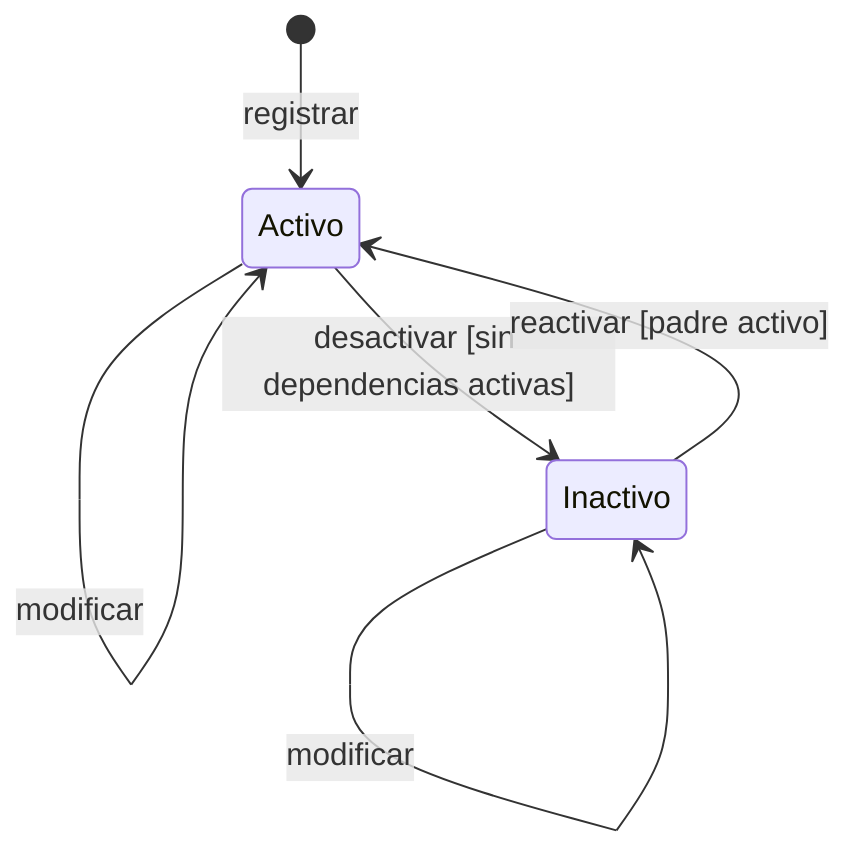

# Modelo de datos · F-002 Catálogos

**Fecha**: 2026-09-14 · **Plan**: [plan.md](plan.md)

**Cambios en el esquema: ninguno.** Las 7 tablas de catálogos (`categoria`, `unidad_medida`,
`producto`, `proveedor`, `proveedor_producto`, `centro_salud`, `representante`) ya existen con sus
columnas, índices únicos y restricciones CHECK desde la migración de F-001. Definición física completa:
[`specs/001-acceso-personal/data-model.md` §3 y §4](../001-acceso-personal/data-model.md).

Este documento fija, por catálogo, **qué valida el esquema Zod, qué normaliza el servicio y qué
garantiza la base**, y las condiciones para desactivar y reactivar.

---

## 1. Validaciones por catálogo

Convención: "texto obligatorio (n)" = se recortan los extremos, mínimo 1 y máximo n caracteres;
"texto opcional (n)" = vacío se guarda como `null`, máximo n. Todos los mensajes, en español.

### Categoría

| Campo | Esquema Zod | Servicio guarda | Base garantiza |
|---|---|---|---|
| nombre | texto obligatorio (60) | `recortarEspacios` + `nombreNormalizado = normalizarTexto` | `nombre_normalizado` UNIQUE |
| descripcion | texto opcional (200) | `recortarEspacios` o `null` | `varchar(200)` |

### Unidad de medida

| Campo | Esquema Zod | Servicio guarda | Base garantiza |
|---|---|---|---|
| nombre | texto obligatorio (40) | `recortarEspacios` + normalizado | `nombre_normalizado` UNIQUE |
| abreviatura | texto obligatorio (10) | `recortarEspacios` | `varchar(10)`, no única |

### Producto

| Campo | Esquema Zod | Servicio guarda | Base garantiza |
|---|---|---|---|
| codigo | recortado, en mayúsculas, `^[A-Z0-9-]{1,20}$` ("Usa hasta 20 caracteres: letras, dígitos y guion") | tal cual | `codigo` UNIQUE |
| nombre | texto obligatorio (80) | `recortarEspacios` + normalizado | `nombre_normalizado` UNIQUE |
| descripcion | texto opcional (200) | `recortarEspacios` o `null` | `varchar(200)` |
| categoriaId | entero positivo, obligatorio ("Elige una categoría") | debe existir y estar activa | FK |
| unidadMedidaId | entero positivo, obligatorio ("Elige una unidad de medida") | debe existir y estar activa; no cambia si hay movimientos (RN-16) | FK |
| stockMinimo | entero ≥ 0 ("El stock mínimo debe ser un número entero mayor o igual a 0") | tal cual | CHECK `producto_stock_minimo_no_negativo` |
| stockActual | **no existe en el esquema**: cualquier valor enviado se descarta (RN-15) | `0` al registrar; nunca lo modifica | CHECK `producto_stock_no_negativo` |

### Proveedor

| Campo | Esquema Zod | Servicio guarda | Base garantiza |
|---|---|---|---|
| razonSocial | texto obligatorio (100) | `recortarEspacios` | no única (FR-019) |
| nit | recortado, `^[0-9]{1,20}$` ("El NIT solo admite dígitos") | tal cual | `nit` UNIQUE + CHECK `proveedor_nit_digitos` |
| contactoNombre | texto opcional (80) | `recortarEspacios` o `null` | `varchar(80)` |
| telefono | opcional (20), `[0-9 +-]` | tal cual o `null` | `varchar(20)` |
| correo | opcional (100), formato de correo ("Escribe un correo con el formato nombre@dominio.com") | en minúsculas o `null` | `varchar(100)` |
| direccion | texto opcional (150) | `recortarEspacios` o `null` | `varchar(150)` |

### Centro de salud

| Campo | Esquema Zod | Servicio guarda | Base garantiza |
|---|---|---|---|
| nombre | texto obligatorio (100) | `recortarEspacios` + normalizado | `nombre_normalizado` UNIQUE |
| telefono | opcional (20), `[0-9 +-]` | tal cual o `null` | `varchar(20)` |
| direccion | texto opcional (150) | `recortarEspacios` o `null` | `varchar(150)` |

### Representante

| Campo | Esquema Zod | Servicio guarda | Base garantiza |
|---|---|---|---|
| nombre, apellido | texto obligatorio (60) | `recortarEspacios` | `varchar(60)` |
| ci | recortado, en mayúsculas, `^[0-9]+(-[0-9A-Z]+)?$`, hasta 15 ("Usa dígitos y, si tiene complemento, un guion: 4567890-1B") | tal cual | `ci` UNIQUE + CHECK `representante_ci_formato` |
| servicio | texto obligatorio (60) | `recortarEspacios` | `varchar(60)` |
| telefono | opcional (20), `[0-9 +-]` | tal cual o `null` | `varchar(20)` |
| centroSaludId | entero positivo, obligatorio ("Elige un centro de salud") | debe existir y estar activo | FK |

### Proveedor–producto

| Campo | Esquema Zod | Servicio guarda | Base garantiza |
|---|---|---|---|
| productoId | entero positivo, obligatorio | producto activo; proveedor activo | FK + `(proveedor_id, producto_id)` UNIQUE |
| precioReferencial | vacío o número con hasta 2 decimales, coma o punto, > 0 y ≤ 9 999 999 999,99 (research C-08) | `Prisma.Decimal` o `null` | `decimal(12,2)` + CHECK `proveedor_producto_precio_positivo` |

---

## 2. Mensajes de duplicado (RN-11, research C-04)

| Catálogo | Campo | Mensaje (registro activo) | Si el existente está inactivo |
|---|---|---|---|
| Categoría | nombre | Ya existe una categoría con el nombre '{valor}' | Ya existe una categoría inactiva con el nombre '{valor}'. + enlace "Ver y reactivar" |
| Unidad de medida | nombre | Ya existe una unidad de medida con el nombre '{valor}' | … inactiva … |
| Producto | código | Ya existe un producto con el código '{valor}' | … un producto inactivo … |
| Producto | nombre | Ya existe un producto con el nombre '{valor}' | … un producto inactivo … |
| Proveedor | NIT | Ya existe un proveedor con el NIT '{valor}' | … un proveedor inactivo … |
| Centro de salud | nombre | Ya existe un centro de salud con el nombre '{valor}' | … inactivo … |
| Representante | CI | Ya existe un representante con el CI '{valor}' | … inactivo … |
| Proveedor–producto | producto | Este proveedor ya ofrece '{nombre del producto}' | Este proveedor ya tenía '{producto}' como inactivo: reactívalo en la lista |

`{valor}` es el valor **guardado** del registro existente (por ejemplo, "Lavandina 1 L" aunque se haya
escrito " lavandina  1 l ").

---

## 3. Ciclo de vida: activo e inactivo

Todos los catálogos siguen el mismo ciclo; cambian las **condiciones** de cada transición.

| Catálogo | No se puede desactivar si… (RN-13) | Mensaje | No se puede reactivar si… (RN-17) | Mensaje |
|---|---|---|---|---|
| Categoría | tiene productos activos | No se puede desactivar: {n} productos activos usan esta categoría | — | — |
| Unidad de medida | tiene productos activos | No se puede desactivar: {n} productos activos usan esta unidad de medida | — | — |
| Producto | tiene saldo pendiente en pedidos PENDIENTE o PARCIAL | No se puede desactivar: {n} pedidos tienen saldo pendiente de este producto | su categoría o unidad está inactiva | Primero reactiva la categoría '{nombre}' (o la unidad '{nombre}'), o cambia el producto a una activa |
| Proveedor | — (sus compras siguen en el histórico) | — | — | — |
| Centro de salud | tiene representantes activos | No se puede desactivar: {n} representantes activos pertenecen a este centro | — | — |
| Representante | tiene pedidos PENDIENTE o PARCIAL | No se puede desactivar: tiene {n} pedidos por atender | su centro de salud está inactivo | Primero reactiva el centro de salud '{nombre}' |
| Proveedor–producto | — | — | el proveedor o el producto está inactivo | No se puede reactivar: el producto '{nombre}' está inactivo |

Con `{n}` = 1 se usa el singular ("1 producto activo usa esta categoría").

**Regla adicional de modificación (RN-16):** si el producto tiene al menos un movimiento de inventario,
cambiar `unidadMedidaId` se rechaza con "La unidad de medida no puede cambiar: el stock y el historial
de este producto están expresados en '{unidad actual}'". Los demás campos sí se pueden cambiar
(FR-027).

**Indicador "Bajo mínimo" (RN-52):** se calcula al listar, no se guarda: producto `activo` y
`stock_actual ≤ stock_minimo`.

---

## 4. Relaciones que usan otras funcionalidades

| Selector | Lo usan | Devuelve |
|---|---|---|
| `listarCategoriasParaSelector(idActual?)` | formulario de producto | categorías activas (+ la actual si está inactiva) |
| `listarUnidadesParaSelector(idActual?)` | formulario de producto | unidades activas con abreviatura |
| `listarProductosParaSelector(idActual?)` | proveedor–producto; F-003 compras; F-004 pedidos | productos activos: "LIM-001 · Lavandina 1 L (Bidón 5 L)" |
| `listarProveedoresParaSelector(idActual?)` | F-003 compras | proveedores activos: "Razón social (NIT)" |
| `listarCentrosSaludParaSelector(idActual?)` | formulario de representante | centros activos |
| `listarRepresentantesParaSelector(idActual?)` | F-004 pedidos | representantes activos: "Apellido, Nombre · Servicio" |
