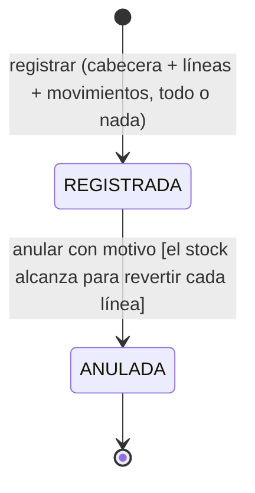

# Modelo de datos · F-003 Compras e inventario

**Fecha**: 2026-09-14 · **Plan**: [plan.md](plan.md)

**Cambios en el esquema: ninguno.** Las tablas `compra`, `compra_detalle` y `movimiento_inventario`,
sus enumeraciones (`estado_documento`, `tipo_movimiento`), el índice único parcial
`compra_factura_vigente_unica` y las restricciones CHECK ya existen desde la migración de F-001.
Definición física completa: [`specs/001-acceso-personal/data-model.md` §3 y
§4](../001-acceso-personal/data-model.md).

Este documento fija qué valida el esquema Zod, qué calcula el servicio y qué garantiza la base, más
el ciclo de vida de la compra y las reglas de cada movimiento.

---

## 1. Registro de una compra

### Cabecera (`esquemaCompra`)

| Campo | Esquema Zod | Servicio guarda | Base garantiza |
|---|---|---|---|
| proveedorId | `idObligatorio("Elige un proveedor")` | debe existir y estar activo ("El proveedor '{razón social}' está inactivo: elige uno activo") | FK |
| nroFactura | recortado, obligatorio ("Escribe el Nº de factura"), `^[0-9]{1,20}$` ("El Nº de factura solo admite dígitos, hasta 20") | tal cual: `0001234` y `1234` son distintos | CHECK `compra_factura_digitos` + índice único parcial por proveedor entre REGISTRADAS |
| fecha | texto `AAAA-MM-DD` válido ("Escribe una fecha válida") y no posterior a hoy en La Paz ("La fecha de la compra no puede ser futura") | `Date` a medianoche UTC en columna `date` | `date` |
| observacion | `textoOpcional("La observación", 200)` | recortada o `null` | `varchar(200)` |
| lineas | arreglo de 1 o más ("Agrega al menos un producto") | — | — |
| subtotal, total | **no existen en el esquema**: se descartan (RN-23, X-14) | los calcula (§2) | CHECK de subtotal exacto y total no negativo |

### Línea

| Campo | Esquema Zod | Mensaje |
|---|---|---|
| productoId | `idObligatorio` | "Elige un producto" |
| cantidad | entero de 1 a 1 000 000 (vacío rechazado) | "La cantidad debe ser un número entero entre 1 y 1.000.000" |
| precioUnitario | `montoPositivo`: texto con coma o punto, mayor que 0, hasta 2 decimales y 10 dígitos enteros | "Escribe un precio mayor que 0 con hasta 2 decimales" |

**Reglas sobre el conjunto** (`superRefine` del esquema, con la ruta de la línea afectada):

| Regla | Mensaje |
|---|---|
| Producto repetido (RN-22) | "Línea {n}: el producto ya está en la línea {m}; modifica su cantidad" |
| Total mayor que 9 999 999 999,99 | "El total de la compra no puede superar Bs 9.999.999.999,99" |

**Mensaje general** del aviso cuando hay errores en líneas: "Revisa los datos marcados", más la lista
"Línea 2: …" para que se lea sin buscar en la tabla (FR-007).

### Verificaciones del servicio (`registrarCompra`)

| Verificación | Mensaje | Campo |
|---|---|---|
| Proveedor inexistente o inactivo | "El proveedor '{razón social}' está inactivo: elige uno activo" | `proveedorId` |
| Producto inexistente o inactivo | "Línea {n}: el producto '{nombre}' está inactivo: elige uno activo" | `lineas.{i}.productoId` |
| Factura vigente del mismo proveedor (RN-21), también por P2002 | "La factura {nro} ya está registrada para este proveedor" + enlace "Ver compra" | `nroFactura` |
| Total mayor que el máximo | el mismo del esquema | — |

---

## 2. Cálculos (RN-23)

| Valor | Dónde | Cómo |
|---|---|---|
| Vista previa del subtotal y el total | navegador | centavos enteros: `aCentavos(precio) × cantidad` (research K-04) |
| `compra_detalle.subtotal` | servidor | `new Prisma.Decimal(precio).mul(cantidad)` |
| `compra.total` | servidor | suma de los subtotales con `Decimal.add` |
| Formato en pantalla | navegador y servidor | "Bs 1.234,50" (`formatearBolivianos`, `formatearCentavos`) |

Ejemplo de la Historia 1 · E2: 10 × 12,50 = 125,00; 4 × 30,00 = 120,00; total 245,00.

---

## 3. Ciclo de vida de la compra



- No hay transición de edición ni de borrado (D-16, FR-010).
- `ANULADA` es final: "La compra ya está anulada" (RN-26).
- La factura de una compra ANULADA queda libre para registrarla otra vez (RN-26).
- Coherencia garantizada por la base: `compra_anulacion_coherente` (ANULADA ⇔ motivo, momento y
  usuario de anulación presentes).

### Anulación (`esquemaAnulacion`)

| Campo | Esquema Zod | Mensaje |
|---|---|---|
| motivo | `textoObligatorio("el motivo de la anulación", "El motivo", 200)` | "Escribe el motivo de la anulación" · "El motivo admite hasta 200 caracteres" |

| Verificación del servicio (`anularCompra`) | Mensaje |
|---|---|
| La compra no existe | "No existe la compra indicada" |
| Ya está ANULADA (incluida la anulación simultánea) | "La compra ya está anulada" |
| Algún producto quedaría negativo (RN-25) | "No se puede anular: faltan {f} unidades de '{producto}' (stock actual {s}, a revertir {c})", uno por producto afectado separados por "; " |

Con `{f}` = 1 se usa "falta 1 unidad".

---

## 4. Movimientos de inventario

| Tipo | Lo genera | Signo de `cantidad` | `fecha_documento` | Documento |
|---|---|---|---|---|
| `ENTRADA_COMPRA` | registrar compra, una por línea | + | fecha de la compra | `compra_id` |
| `ANULACION_COMPRA` | anular compra, una por línea | − | fecha de la compra anulada (RN-53) | `compra_id` |
| `SALIDA_DISTRIBUCION` | F-005 | − | fecha de la distribución | `distribucion_id` |
| `ANULACION_DISTRIBUCION` | F-005 | + | fecha de la distribución anulada | `distribucion_id` |

**Invariantes** (la base respalda las marcadas con CHECK):

| Invariante | Quién la garantiza |
|---|---|
| `cantidad ≠ 0` | CHECK `movimiento_cantidad_no_cero` |
| Signo coherente con el tipo | CHECK `movimiento_signo_coherente` |
| Documento coherente con el tipo | CHECK `movimiento_origen_coherente` |
| `saldo_resultante ≥ 0` y `stock_actual ≥ 0` | `registrarMovimiento` (con bloqueo) + CHECK `movimiento_saldo_no_negativo` y `producto_stock_no_negativo` |
| `saldo_resultante` = saldo anterior + cantidad, en orden de `id` (RN-51) | `registrarMovimiento` con `SELECT … FOR UPDATE` (research K-01) |
| `stock_actual` = Σ `cantidad` (RN-50) | `registrarMovimiento`; comprobable con `verificarConsistenciaInventario` |
| Un movimiento nunca se edita ni se borra | ningún servicio exporta funciones para hacerlo (prueba) |

**Secuencia dentro de una transacción de documento**:

```text
1. crear o actualizar el documento (compra con líneas | compra → ANULADA)
2. bloquearProductos(tx, ids ordenados)        → SELECT … ORDER BY id FOR UPDATE
3. [anulación] verificar faltantes de todos los productos y rechazar con un único error
4. por cada línea, en orden de producto: registrarMovimiento(tx, …)
      saldo = stock_actual + cantidad  →  saldo < 0 ⇒ error
      INSERT movimiento_inventario (…, saldo_resultante = saldo)
      UPDATE producto SET stock_actual = saldo
5. COMMIT (o ROLLBACK completo ante cualquier error)
```

Error de `registrarMovimiento` si el saldo quedaría negativo (lo usará F-005; en F-003 solo puede
ocurrir en una anulación, que ya lo verifica antes): "Stock insuficiente de '{producto}': hay {s} y
se necesitan {n}".

---

## 5. Consultas

### Existencias (FR-018, research K-07)

| Parámetro | Valores | Por defecto |
|---|---|---|
| `q` | código o nombre, sin mayúsculas ni tildes, hasta 60 | vacío |
| `categoria` | id de categoría | todas |
| `estado` | `habituales` (activos e inactivos con stock), `inactivos`, `todos` | `habituales` |
| `bajoMinimo` | `si` | no |

Fila: código, producto, categoría, unidad, stock actual, stock mínimo, indicador ("Bajo mínimo",
"Inactivo"), enlace al kardex. Orden: bajo mínimo primero, luego nombre. Encabezado: "{n} productos
· {b} bajo mínimo" (solo activos cuentan como bajo mínimo, RN-52).

### Kardex (FR-019, research K-08)

| Parámetro | Valores | Por defecto |
|---|---|---|
| `desde`, `hasta` | fecha `AAAA-MM-DD` (del documento); `desde ≤ hasta` ("La fecha «desde» no puede ser posterior a «hasta»") | sin rango |

Fila: fecha del documento, registrado el, tipo ("Entrada por compra", "Anulación de compra",
"Salida por distribución", "Anulación de distribución"), documento ("Factura 1234 · Distribuidora
Andina" enlazado a `/compras/[id]`; "Vale 56 · Quispe, Ana" enlazado a `/distribuciones/[id]`),
entrada, salida, saldo. Encabezado: producto, unidad, stock actual; con rango, saldo anterior y saldo
final. Sin movimientos: "Sin movimientos".

### Verificación de consistencia (FR-020)

Resultado: fecha y hora de la verificación, cantidad de productos revisados y tabla de diferencias
(código, producto, stock actual, suma de movimientos, diferencia). Sin diferencias: "El inventario
es consistente: el stock de los {n} productos coincide con la suma de sus movimientos".

### Listado de compras (FR-008, research K-09)

| Parámetro | Valores | Por defecto |
|---|---|---|
| `desde`, `hasta` | fecha `AAAA-MM-DD`, `desde ≤ hasta` | primer día del mes en curso · hoy |
| `proveedor` | id de proveedor (activo o inactivo) | todos |
| `estado` | `todas`, `registradas`, `anuladas` | `todas` |
| `factura` | dígitos, hasta 20; busca los números que empiezan con ese texto | vacío |
| `pagina` | entero ≥ 1 | 1 |

Fila: fecha, Nº de factura, proveedor, ítems, total, estado. Orden: fecha y `id` descendentes. 50 por
página.

---

## 6. Relación con otras funcionalidades

| Funcionalidad | Qué usa de F-003 |
|---|---|
| F-002 | La ficha del producto enlaza a su kardex; `obtenerProducto.tieneMovimientos` (RN-16) ya cuenta movimientos |
| F-005 | `bloquearProductos` y `registrarMovimiento` para salidas y anulaciones de distribución; la anulación de compra rechaza si el stock ya se distribuyó |
| F-006 | Compras REGISTRADAS por `fecha`; kardex y saldos por `fecha_documento` (RN-53) |
| F-007 | El generador de datos registra compras con `registrarCompra`; la serie mensual agrupa por `fecha_documento` |
