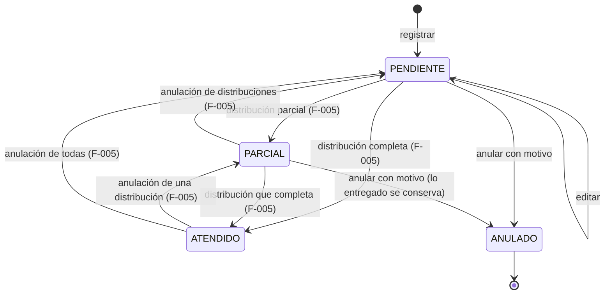

# Modelo de datos · F-004 Pedidos

**Fecha**: 2026-09-15 · **Plan**: [plan.md](plan.md)

**Cambios en el esquema: ninguno.** Las tablas `pedido` y `pedido_detalle`, la enumeración
`estado_pedido`, el índice `(estado, fecha)`, la restricción única `(pedido_id, producto_id)` y las CHECK
`pedido_anulacion_coherente`, `pedido_detalle_solicitada_positiva` y
`pedido_detalle_entregada_en_rango` ya existen desde la migración de F-001. Definición física completa:
[`specs/001-acceso-personal/data-model.md` §3 y §4](../001-acceso-personal/data-model.md).

---

## 1. Registro y edición (`esquemaPedido`)

### Cabecera

| Campo | Esquema Zod | Servicio | Base garantiza |
|---|---|---|---|
| representanteId | `idObligatorio("Elige un representante")` | existe y está activo ("El representante '{Apellido, Nombre}' está inactivo: elige uno activo"); al editar se acepta el que ya tenía | FK |
| fecha | `fechaNoFutura("La fecha del pedido no puede ser futura")` | `aFechaDocumento` | `date` |
| observacion | `textoOpcional("La observación", 200)` | recortada o `null` | `varchar(200)` |
| lineas | arreglo de 1 o más ("Agrega al menos un producto") | — | — |
| estado, cantidadEntregada, número | **no existen en el esquema**: el estado lo calcula el sistema (RN-41), lo entregado lo cambian las distribuciones (FR-009) y el número es el `id` (research P-01) | `PENDIENTE` y 0 al registrar | CHECK de entregada en rango |

### Línea

| Campo | Esquema Zod | Mensaje |
|---|---|---|
| productoId | `idObligatorio` | "Elige un producto" |
| cantidadSolicitada | `cantidadEntera(...)`: entero de 1 a 1 000 000, vacío rechazado | "La cantidad debe ser un número entero entre 1 y 1.000.000" |

**Regla sobre el conjunto** (`marcarProductosRepetidos`, compartida con compras): "Línea {n}: el producto
ya está en la línea {m}; modifica su cantidad" (RN-40), en `lineas.{i}.productoId`.

### Verificaciones del servicio

| Verificación | Mensaje | Campo |
|---|---|---|
| Representante inexistente o inactivo | "El representante '{Apellido, Nombre}' está inactivo: elige uno activo" | `representanteId` |
| Producto inexistente o inactivo (al editar, salvo que ya estuviera en el pedido) | "Línea {n}: el producto '{nombre}' está inactivo: elige uno activo" | `lineas.{i}.productoId` |
| Editar un pedido que no está PENDIENTE (RN-42) | según §3 | — |
| Quitar al editar una línea que figura en distribuciones anuladas | "No se puede quitar '{producto}': figura en distribuciones anuladas del pedido. Puedes cambiar su cantidad" | — |

---

## 2. Estado calculado (RN-41, research P-02)

```text
calcularEstadoPedido(lineas):
  si ninguna línea tiene cantidadEntregada > 0            → PENDIENTE
  si todas tienen cantidadEntregada = cantidadSolicitada  → ATENDIDO
  si no                                                   → PARCIAL

recalcularEstadoPedido(tx, pedidoId):   (lo llama F-005 tras cambiar lo entregado)
  pedido ANULADO → no cambia (RN-35)
  otro           → estado = calcularEstadoPedido(líneas)
```

Valores derivados que se calculan al mostrar, no se guardan:

| Valor | Fórmula |
|---|---|
| Pendiente de una línea | `solicitada − entregada` |
| Saldo anulado de una línea (pedido ANULADO) | `solicitada − entregada` |
| Porcentaje atendido del pedido | `⌊ Σ entregada × 100 / Σ solicitada ⌋` (hacia abajo: 199 de 200 = 99 %) |

---

## 3. Ciclo de vida



### Anulación (`esquemaAnulacionPedido`)

| Campo | Esquema Zod | Mensajes |
|---|---|---|
| motivo | `textoObligatorio("el motivo de la anulación", "El motivo", 200)` | "Escribe el motivo de la anulación" · "El motivo admite hasta 200 caracteres" |

### Rechazos por estado (verificados con el pedido bloqueado, research P-03)

| Operación | Estado actual | Mensaje |
|---|---|---|
| Editar | PARCIAL o ATENDIDO | "El pedido ya tiene entregas y no se puede editar" |
| Editar | ANULADO | "El pedido está anulado y no se puede editar" |
| Anular | ATENDIDO | "El pedido ya está atendido y no se puede anular" |
| Anular | ANULADO | "El pedido ya está anulado" |
| Cualquiera | no existe | "No existe el pedido indicado" |

---

## 4. Consultas

### Listado (FR-013, research P-07)

| Parámetro | Valores | Por defecto |
|---|---|---|
| `estado` | `por-atender`, `pendientes`, `parciales`, `atendidos`, `anulados`, `todos` | `por-atender` |
| `representante` | id de representante (activo o inactivo) | todos |
| `desde`, `hasta` | fecha `AAAA-MM-DD`, opcionales; `desde ≤ hasta` ("La fecha «desde» no puede ser posterior a «hasta»") | sin rango |
| `pagina` | entero ≥ 1 | 1 |

Fila: Nº, fecha, representante ("Apellido, Nombre"), servicio, productos (cantidad de líneas), %
atendido, estado. Orden: fecha y `id` ascendentes. 50 por página.

### Detalle (FR-014, research P-08)

Cabecera: Nº, fecha, representante y servicio, centro de salud, observación, estado, registrado por y
cuándo; si está ANULADO, motivo, anulado por y cuándo. Líneas: código, producto, unidad, solicitado,
entregado y pendiente (o saldo anulado). Distribuciones: Nº de vale, fecha, estado, enlace. Acciones
según el estado (research P-08).

---

## 5. Relación con otras funcionalidades

| Funcionalidad | Qué usa de F-004 |
|---|---|
| F-002 | RN-13 ya cuenta pedidos PENDIENTE y PARCIAL para impedir desactivar representantes y productos; la ficha del representante enlaza a sus pedidos |
| F-005 | `bloquearPedido` (primero el pedido, después los productos), `recalcularEstadoPedido`, `listarPedidosPorAtender` para elegir el pedido y la regla de fecha de distribución ≥ fecha del pedido |
| F-006 | Reporte de pedidos con entregado y saldo anulado |
| F-007 | Informe de distribuciones |
