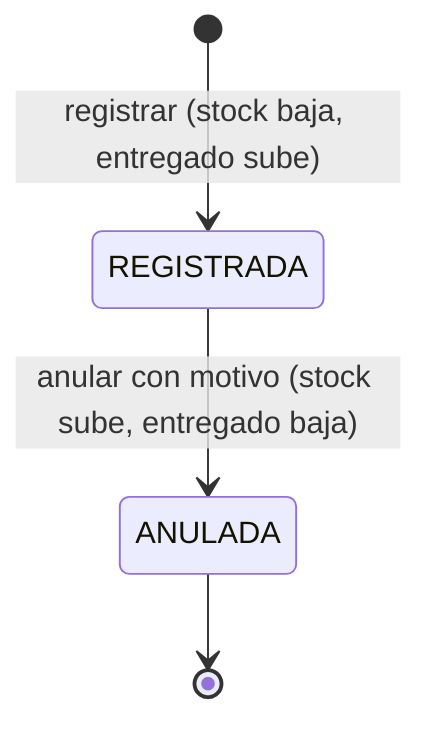

# Modelo de datos · F-005 Distribución

**Fecha**: 2026-09-15 · **Plan**: [plan.md](plan.md)

**Cambios en el esquema: ninguno.** Las tablas `distribucion` y `distribucion_detalle`, la enumeración
`estado_documento`, el índice único parcial `distribucion_vale_vigente_unico` (vale único entre
REGISTRADAS), los índices `(fecha)` y `(pedido_id)`, la restricción única `(distribucion_id,
pedido_detalle_id)` y las CHECK `distribucion_vale_digitos`, `distribucion_anulacion_coherente`,
`distribucion_detalle_cantidad_positiva`, `movimiento_origen_coherente`, `movimiento_signo_coherente` y
`movimiento_saldo_no_negativo` ya existen desde la migración de F-001. Definición física completa:
[`specs/001-acceso-personal/data-model.md` §3 y §4](../001-acceso-personal/data-model.md).

Relaciones que usa F-005:

```text
pedido 1 ── * distribucion 1 ── * distribucion_detalle * ── 1 pedido_detalle * ── 1 producto
                     └──────── * movimiento_inventario (SALIDA_DISTRIBUCION / ANULACION_DISTRIBUCION)
```

La distribución **no guarda** representante ni producto: el representante sale del pedido y el producto de
la línea del pedido (X-08).

---

## 1. Registro (`esquemaDistribucion`)

### Cabecera

| Campo | Esquema Zod | Servicio (con pedido y productos bloqueados) | Base garantiza |
|---|---|---|---|
| pedidoId | `idObligatorio("Elige un pedido")` | existe; PENDIENTE o PARCIAL (§3) | FK |
| nroVale | texto, solo dígitos, 1 a 20 ("El Nº de vale solo admite dígitos, hasta 20"); ceros a la izquierda se conservan | no está en otra distribución REGISTRADA ("El vale {n} ya está registrado", con enlace) | CHECK dígitos · índice único parcial |
| fecha | `fechaNoFutura("La fecha de la distribución no puede ser futura")` | ≥ fecha del pedido ("La fecha de la distribución debe estar entre el {dd/mm/aaaa} y hoy") | `date` |
| observacion | `textoOpcional("La observación", 200)` | recortada o `null` | `varchar(200)` |
| lineas | una entrada por fila del formulario; al menos una con cantidad ("Entrega al menos un producto: escribe la cantidad en una línea") | se ignoran las vacías (RN-33) | — |
| estado, usuario, representante, montos | **no existen en el esquema**: REGISTRADA al guardar, usuario de la sesión, representante del pedido | — | CHECK de anulación coherente |

### Línea

| Campo | Esquema Zod | Servicio | Base garantiza |
|---|---|---|---|
| pedidoDetalleId | `idObligatorio` | pertenece al pedido ("Línea {n}: el producto no pertenece al pedido") | FK · única por distribución |
| cantidad | vacía → sin entrega; si no, entero de 1 a 1 000 000 ("La cantidad debe ser un número entero entre 1 y 1.000.000") | ≤ máximo entregable (§2) | CHECK `cantidad > 0` |

### Verificación de cantidades (RN-32, FR-003, FR-009)

Con el pedido y los productos bloqueados, para cada línea con cantidad:

```text
pendiente           = cantidad_solicitada − cantidad_entregada   (vigentes)
maximoEntregable    = min(pendiente, stock_actual)
si cantidad > maximoEntregable → "{producto}: puedes entregar como máximo {max} (pendiente {p}, stock {s})"
```

Todas las líneas que fallan se informan juntas; el campo marcado es `lineas.{i}.cantidad` de la primera.

---

## 2. Situación de cada línea en el formulario (RN-36, FR-002)

`obtenerPedidoParaDistribuir(pedidoId)` devuelve, por línea del pedido:

| Valor | Fórmula o fuente |
|---|---|
| producto, código, unidad, activo | línea del pedido → producto |
| solicitada, entregada | línea del pedido |
| pendiente | `solicitada − entregada` |
| stockActual | producto (informativo: puede cambiar antes de guardar) |
| maximoEntregable | `min(pendiente, stockActual)` |
| situacion | `"completa"` si pendiente = 0 · `"sin-stock"` si stock = 0 · `"entregable"` en otro caso |

Solo las líneas `"entregable"` admiten cantidad.

---

## 3. Efectos en el inventario y en el pedido

### Registrar (RN-30, RN-34, FR-005)

| Por cada línea con cantidad `c` | Efecto |
|---|---|
| `distribucion_detalle` | nueva fila con `c` |
| `movimiento_inventario` | `SALIDA_DISTRIBUCION`, cantidad `−c`, saldo resultante, `fecha_documento` = fecha de la distribución, `distribucion_id` |
| `producto.stock_actual` | `− c` (solo por `registrarMovimiento`) |
| `pedido_detalle.cantidad_entregada` | `+ c` |
| `pedido.estado` | `recalcularEstadoPedido` (RN-41) |

### Anular (RN-35, FR-014)

| Por cada línea con cantidad `c` | Efecto |
|---|---|
| `distribucion` | ANULADA, motivo, `anulada_en`, `anulada_por_id` |
| `movimiento_inventario` | `ANULACION_DISTRIBUCION`, cantidad `+c`, saldo resultante, `fecha_documento` = fecha de la distribución anulada (RN-53) |
| `producto.stock_actual` | `+ c` |
| `pedido_detalle.cantidad_entregada` | `− c` |
| `pedido.estado` | `recalcularEstadoPedido`; un ANULADO sigue ANULADO y su saldo anulado sube |

### Ciclo de vida



### Rechazos por estado (verificados con el pedido bloqueado)

| Operación | Situación | Mensaje |
|---|---|---|
| Registrar | pedido ATENDIDO | "El pedido ya está atendido: no queda nada por entregar" |
| Registrar | pedido ANULADO | "El pedido está anulado: no se puede distribuir" |
| Registrar | pedido inexistente | "No existe el pedido indicado" |
| Anular | distribución ANULADA | "La distribución ya está anulada" |
| Anular | distribución inexistente | "No existe la distribución indicada" |

### Anulación (`esquemaAnulacionDistribucion`)

| Campo | Esquema Zod | Mensajes |
|---|---|---|
| motivo | `textoObligatorio("el motivo de la anulación", "El motivo", 200)` | "Escribe el motivo de la anulación" · "El motivo admite hasta 200 caracteres" |

---

## 4. Consultas

### Listado (FR-010, research V-07)

| Parámetro | Valores | Por defecto |
|---|---|---|
| `desde`, `hasta` | fecha `AAAA-MM-DD`; `desde ≤ hasta` ("La fecha «desde» no puede ser posterior a «hasta»") | mes en curso hasta hoy |
| `representante` | id (activo o inactivo), por el pedido | todos |
| `producto` | id (activo o inactivo), por las líneas | todos |
| `estado` | `todas`, `registradas`, `anuladas` | `todas` |
| `vale` | dígitos, empieza con | — |
| `pagina` | entero ≥ 1 | 1 |

Fila: fecha, Nº de vale, Nº de pedido, representante ("Apellido, Nombre"), servicio, productos (cantidad de
líneas), unidades entregadas (suma de cantidades), estado. Orden: fecha e `id` descendentes. 50 por página.

### Detalle (FR-011, research V-08)

Nº de vale, fecha, observación, estado; pedido (Nº enlazado, fecha, estado); representante, servicio y
centro de salud del pedido; líneas con código, producto, unidad y cantidad; registrada por y cuándo; si está
ANULADA, motivo, anulada por y cuándo. Acciones: "Imprimir vale" siempre; "Anular distribución" solo si
está REGISTRADA.

### Vale impreso (FR-016, research V-09)

Mismos datos que el detalle, sin datos de registro, con espacios de firma y la leyenda ANULADA si
corresponde.

---

## 5. Invariantes que se prueban

| Invariante | Requisito |
|---|---|
| `stock_actual` ≥ 0 siempre, incluso con distribuciones simultáneas | FR-006, SC-002 |
| `stock_actual` = suma de movimientos del producto | SC-006 (verificación de F-003) |
| `cantidad_entregada` de cada línea = suma de sus `distribucion_detalle` de distribuciones REGISTRADAS | SC-005 |
| Estado del pedido = `calcularEstadoPedido(líneas)` salvo ANULADO | RN-41 |
| Ninguna distribución se edita ni se borra | FR-012, principio IV |

---

## 6. Relación con otras funcionalidades

| Funcionalidad | Qué usa de F-005 o qué le da |
|---|---|
| F-003 | `registrarMovimiento` y `bloquearProductos`; el kardex ya enlaza a `/distribuciones/[id]` con "Vale {n} · representante" |
| F-004 | `bloquearPedido`, `recalcularEstadoPedido`, `listarPedidos({ estado: "por-atender" })`; la ficha del pedido lista sus distribuciones y enlaza a `/distribuciones/nueva?pedido={id}` |
| F-006 | Reporte de distribuciones por período (por `fecha_documento`) |
| F-007 | Consumo mensual por producto a partir de los movimientos `SALIDA_DISTRIBUCION` menos `ANULACION_DISTRIBUCION` |
